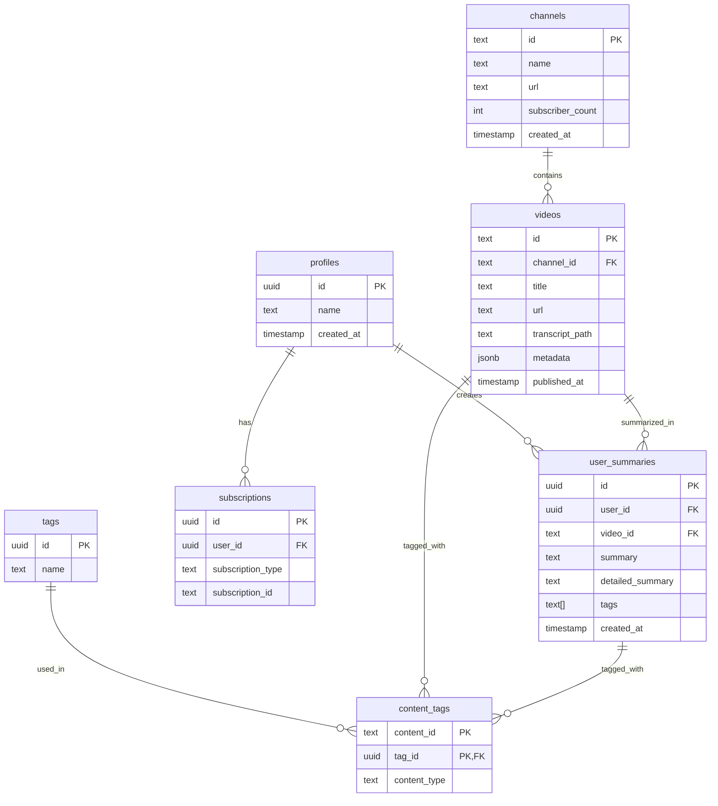

# Supabase Database Documentation

## Table of Contents

1. [Overview](#overview)
2. [Tables](#tables)
   - [Profiles](#profiles)
   - [Channels](#channels)
   - [Videos](#videos)
   - [User Summaries](#user-summaries)
   - [Tags](#tags)
   - [Content Tags](#content-tags)
   - [Subscriptions](#subscriptions)
3. [Row Level Security Policies](#row-level-security-policies)
4. [Indexes](#indexes)
5. [Triggers](#triggers)
6. [Common Operations](#common-operations)
7. [Entity Relationships](#entity-relationships)
8. [Important Notes](#important-notes)
9. [Common Gotchas](#common-gotchas)
10. [Security](#security)
11. [Backup and Recovery](#backup-and-recovery)

## Overview

This database is designed to support a video summarization platform with the following key features:

- User profile management
- YouTube channel and video tracking
- Video summaries with tagging
- Channel subscriptions
- Row-level security for data protection

## Tables

### Profiles

Extends Supabase Auth with additional user metadata.

**Table Name:** `profiles`

| Column     | Type                     | Constraints                                          | Description                |
| ---------- | ------------------------ | ---------------------------------------------------- | -------------------------- |
| id         | UUID                     | PRIMARY KEY, REFERENCES auth.users ON DELETE CASCADE | User's UUID from Auth      |
| name       | TEXT                     |                                                      | User's display name        |
| created_at | TIMESTAMP WITH TIME ZONE | NOT NULL, DEFAULT now()                              | Profile creation timestamp |

**Policies:**

- SELECT: Only owner can view their profile (`auth.uid() = id`)
- UPDATE: Only owner can update their profile (`auth.uid() = id`)

### Channels

Stores information about YouTube channels.

**Table Name:** `channels`

| Column           | Type                     | Constraints             | Description                |
| ---------------- | ------------------------ | ----------------------- | -------------------------- |
| id               | TEXT                     | PRIMARY KEY             | Channel identifier         |
| name             | TEXT                     | NOT NULL                | Channel name               |
| url              | TEXT                     | NOT NULL                | Channel URL                |
| subscriber_count | INTEGER                  | DEFAULT 0               | Number of subscribers      |
| created_at       | TIMESTAMP WITH TIME ZONE | NOT NULL, DEFAULT now() | Channel creation timestamp |

**Policies:**

- SELECT: Public access (true)
- INSERT: Authenticated users only (`auth.role() = 'authenticated'`)
- UPDATE: Authenticated users only (`auth.role() = 'authenticated'`)

### Videos

Stores YouTube videos with their transcripts and metadata.

**Table Name:** `videos`

| Column            | Type                     | Constraints                               | Description               |
| ----------------- | ------------------------ | ----------------------------------------- | ------------------------- |
| id                | TEXT                     | PRIMARY KEY                               | Video identifier          |
| channel_id        | TEXT                     | REFERENCES channels(id) ON DELETE CASCADE | Associated channel        |
| unique_identifier | TEXT                     | UNIQUE, NOT NULL                          | Normalized URL identifier |
| title             | TEXT                     | NOT NULL                                  | Video title               |
| url               | TEXT                     | NOT NULL                                  | Video URL                 |
| transcript_path   | TEXT                     | NOT NULL                                  | Path to stored transcript |
| language          | TEXT                     | NOT NULL, DEFAULT 'en'                    | Video language            |
| metadata          | JSONB                    |                                           | Additional video metadata |
| published_at      | TIMESTAMP WITH TIME ZONE | NOT NULL                                  | Video publication date    |
| last_updated      | TIMESTAMP WITH TIME ZONE | NOT NULL, DEFAULT now()                   | Last update timestamp     |
| created_at        | TIMESTAMP WITH TIME ZONE | NOT NULL, DEFAULT now()                   | Video creation timestamp  |

**Policies:**

- SELECT: Public access (true)
- INSERT: Authenticated users only (`auth.role() = 'authenticated'`)
- UPDATE: Authenticated users only (`auth.role() = 'authenticated'`)

### User Summaries

Stores user-specific video summaries with optional detailed versions.

**Table Name:** `user_summaries`

| Column           | Type                     | Constraints                               | Description              |
| ---------------- | ------------------------ | ----------------------------------------- | ------------------------ |
| id               | UUID                     | PRIMARY KEY, DEFAULT gen_random_uuid()    | Summary identifier       |
| user_id          | UUID                     | REFERENCES profiles(id) ON DELETE CASCADE | Owner of the summary     |
| video_id         | TEXT                     | REFERENCES videos(id) ON DELETE CASCADE   | Associated video         |
| summary          | TEXT                     | NOT NULL                                  | Brief summary            |
| detailed_summary | TEXT                     |                                           | Detailed summary version |
| tags             | TEXT[]                   | NOT NULL, DEFAULT '{}'                    | Array of tags            |
| created_at       | TIMESTAMP WITH TIME ZONE | NOT NULL, DEFAULT now()                   | Creation timestamp       |
| updated_at       | TIMESTAMP WITH TIME ZONE | NOT NULL, DEFAULT now()                   | Last update timestamp    |

**Policies:**

- SELECT: Only owner can view their summaries (`auth.uid() = user_id`)
- INSERT: Only owner can create summaries (`auth.uid() = user_id`)
- UPDATE: Only owner can update their summaries (`auth.uid() = user_id`)
- DELETE: Only owner can delete their summaries (`auth.uid() = user_id`)

### Tags

Reusable tags for categorizing content.

**Table Name:** `tags`

| Column | Type | Constraints                            | Description    |
| ------ | ---- | -------------------------------------- | -------------- |
| id     | UUID | PRIMARY KEY, DEFAULT gen_random_uuid() | Tag identifier |
| name   | TEXT | UNIQUE, NOT NULL                       | Tag name       |

**Policies:**

- SELECT: Public access (true)
- INSERT: Authenticated users only (`auth.role() = 'authenticated'`)

### Content Tags

Associates tags with videos or summaries.

**Table Name:** `content_tags`

| Column       | Type | Constraints                                            | Description            |
| ------------ | ---- | ------------------------------------------------------ | ---------------------- |
| content_id   | TEXT | NOT NULL                                               | ID of video or summary |
| tag_id       | UUID | REFERENCES tags(id) ON DELETE CASCADE                  | Associated tag         |
| content_type | TEXT | NOT NULL, CHECK (content_type IN ('video', 'summary')) | Type of content        |

**Primary Key:** (content_id, tag_id)

**Policies:**

- SELECT: Public access (true)
- INSERT: Authenticated users only (`auth.role() = 'authenticated'`)

### Subscriptions

Tracks user subscriptions to channels.

**Table Name:** `subscriptions`

| Column            | Type                     | Constraints                               | Description                            |
| ----------------- | ------------------------ | ----------------------------------------- | -------------------------------------- |
| id                | UUID                     | PRIMARY KEY, DEFAULT gen_random_uuid()    | Subscription identifier                |
| user_id           | UUID                     | REFERENCES profiles(id) ON DELETE CASCADE | Subscriber                             |
| subscription_type | subscription_type        | NOT NULL                                  | Type of subscription (enum: 'channel') |
| subscription_id   | TEXT                     | NOT NULL                                  | ID of subscribed content               |
| created_at        | TIMESTAMP WITH TIME ZONE | NOT NULL, DEFAULT now()                   | Subscription timestamp                 |

**Unique Constraint:** (user_id, subscription_type, subscription_id)

**Policies:**

- SELECT: Only owner can view their subscriptions (`auth.uid() = user_id`)
- INSERT: Only owner can create subscriptions (`auth.uid() = user_id`)
- DELETE: Only owner can delete their subscriptions (`auth.uid() = user_id`)

## Row Level Security Policies

All tables have Row Level Security (RLS) enabled. The general pattern for policies is:

- Public data (channels, videos, tags) is readable by everyone
- Private data (profiles, summaries, subscriptions) is only accessible by the owner
- Write operations (INSERT, UPDATE, DELETE) require authentication
- Owner-specific operations require `auth.uid()` to match the `user_id`

## Indexes

The following indexes are created for performance:

| Table          | Index Name                    | Columns           | Description                  |
| -------------- | ----------------------------- | ----------------- | ---------------------------- |
| videos         | idx_videos_channel_id         | channel_id        | Optimize channel lookups     |
| videos         | idx_videos_published_at       | published_at DESC | Sort by publication date     |
| videos         | idx_videos_unique_identifier  | unique_identifier | Unique URL lookups           |
| user_summaries | idx_user_summaries_user_id    | user_id           | User's summaries lookups     |
| user_summaries | idx_user_summaries_video_id   | video_id          | Video summaries lookups      |
| user_summaries | idx_user_summaries_created_at | created_at DESC   | Sort by creation date        |
| content_tags   | idx_content_tags_content_id   | content_id        | Content lookups              |
| content_tags   | idx_content_tags_tag_id       | tag_id            | Tag lookups                  |
| subscriptions  | idx_subscriptions_user_id     | user_id           | User's subscriptions lookups |

## Triggers

### Updated At Timestamp

A trigger function `update_updated_at_column()` automatically updates the `updated_at` column whenever a record is modified.

**Applied to:**

- user_summaries table (BEFORE UPDATE trigger)

```sql
CREATE OR REPLACE FUNCTION update_updated_at_column()
RETURNS TRIGGER AS $$
BEGIN
  NEW.updated_at = timezone('utc'::text, now());
  RETURN NEW;
END;
$$ language 'plpgsql';
```

## Common Operations

### Profile Management

```sql
-- Create a new profile (automatically triggered by Supabase Auth)
INSERT INTO profiles (id, name)
VALUES (auth.uid(), 'User Name');

-- Update profile name
UPDATE profiles
SET name = 'New Name'
WHERE id = auth.uid();
```

### Video Management

```sql
-- Add a new video with its channel
-- First, ensure channel exists or create it
INSERT INTO channels (id, name, url)
VALUES ('channel123', 'Channel Name', 'https://youtube.com/c/channel123')
ON CONFLICT (id) DO UPDATE
SET name = EXCLUDED.name;

-- Then add the video
INSERT INTO videos (
  id, channel_id, unique_identifier, title, url,
  transcript_path, published_at
)
VALUES (
  'video123',
  'channel123',
  'normalized-url-identifier',
  'Video Title',
  'https://youtube.com/watch?v=video123',
  '/transcripts/video123.txt',
  NOW()
);
```

### Summary Management

```sql
-- Create a new summary
INSERT INTO user_summaries (
  user_id, video_id, summary, detailed_summary, tags
)
VALUES (
  auth.uid(),
  'video123',
  'Brief summary text',
  'Detailed summary text',
  ARRAY['tag1', 'tag2']
);

-- Get all summaries for a user with video details
SELECT
  s.*,
  v.title as video_title,
  v.url as video_url
FROM user_summaries s
JOIN videos v ON s.video_id = v.id
WHERE s.user_id = auth.uid()
ORDER BY s.created_at DESC;
```

### Subscription Management

```sql
-- Subscribe to a channel
INSERT INTO subscriptions (
  user_id, subscription_type, subscription_id
)
VALUES (
  auth.uid(),
  'channel',
  'channel123'
)
ON CONFLICT (user_id, subscription_type, subscription_id) DO NOTHING;

-- Get all subscribed channels with their latest videos
SELECT
  c.*,
  v.id as latest_video_id,
  v.title as latest_video_title
FROM subscriptions s
JOIN channels c ON s.subscription_id = c.id
LEFT JOIN videos v ON c.id = v.channel_id
WHERE s.user_id = auth.uid()
  AND s.subscription_type = 'channel'
ORDER BY v.published_at DESC;
```

## Entity Relationships



## Important Notes

1. **Authentication Context**

   - All database operations require a valid authentication context
   - `auth.uid()` is automatically provided by Supabase when authenticated
   - RLS policies use `auth.uid()` to enforce access control

2. **Cascading Deletes**

   - Deleting a profile cascades to user_summaries and subscriptions
   - Deleting a channel cascades to its videos
   - Deleting a video cascades to its summaries
   - Deleting a tag cascades to content_tags

3. **Performance Considerations**

   - Use the provided indexes for optimal query performance
   - The `videos.metadata` JSONB field allows flexible metadata storage but should be used judiciously
   - Consider pagination when querying large datasets

4. **Data Integrity**

   - All timestamps are stored in UTC
   - The `unique_identifier` in videos table ensures no duplicate videos
   - Tags array in user_summaries is denormalized for performance
   - Channel subscriptions are unique per user-channel combination

5. **Supabase Specifics**
   - The database is accessed through Supabase's client libraries
   - Real-time subscriptions are available for all tables
   - Full-text search is available through Postgres text search capabilities
   - Policies automatically filter data based on the authenticated user

## Common Gotchas and Solutions

1. **Authentication Required**

   ```typescript
   // Always ensure user is authenticated before database operations
   const {
     data: { user },
   } = await supabase.auth.getUser();
   if (!user) throw new Error('Authentication required');
   ```

2. **Handling Real-time Updates**

   ```typescript
   // Subscribe to changes in user's summaries
   const subscription = supabase
     .channel('summaries')
     .on(
       'postgres_changes',
       { event: '*', schema: 'public', table: 'user_summaries', filter: `user_id=eq.${user.id}` },
       payload => {
         console.log('Change received!', payload);
       },
     )
     .subscribe();
   ```

3. **Efficient Queries**

   ```typescript
   // Use select() to limit returned columns
   const { data: summaries } = await supabase
     .from('user_summaries')
     .select(
       `
       id,
       summary,
       videos (
         title,
         url
       )
     `,
     )
     .order('created_at', { ascending: false })
     .limit(10);
   ```

4. **Handling JSONB Metadata**
   ```typescript
   // Querying JSONB fields
   const { data: videos } = await supabase
     .from('videos')
     .select()
     .contains('metadata', { duration: '>10:00' });
   ```

## Security Best Practices

1. Never expose database credentials in client-side code
2. Always use RLS policies to restrict data access
3. Validate input data before inserting into the database
4. Use parameterized queries to prevent SQL injection
5. Keep the Supabase project URL and anon key in environment variables

## Backup and Recovery

1. Supabase automatically creates daily backups
2. Point-in-time recovery is available
3. You can manually create backups from the dashboard
4. Local development should maintain its own backup strategy
